# Unified P2P Knowledge Graph

The capability ontology of the unified model: the six pillars, the processes and records inside them, the roles, the platform services, the insights, and the typed relationships. Expanded from the blueprint graph to the unified model's actual scope (full source-to-pay, finance controls, returns). Machine-readable mirror in `graph.json` (node ids match).

## How to read

Node types: rounded = process, rectangle = record/entity, stadium = role, hexagon = platform service, parallelogram = insight/KPI, cylinder = external system. Edge labels: `next` (process sequence), `produces` (process to record), `uses` (record to master data), `governed by` (process to service), `performs` (role to process), `feeds` (record to insight), `sync` (service to external).

```mermaid
graph TD
  %% ROLES
  A_REQ([Requester]); A_APPR([Approver]); A_BUYER([Procurement / Buyer])
  A_FINM([Finance - Maker]); A_FINC([Finance - Checker]); A_MGMT([Management])
  A_SUP([Supplier / Vendor]); A_RECV([Receiving / Warehouse]); A_QC([Quality])
  A_ENG([Engineering]); A_BUD([Budget Owner]); A_TAX([Tax / Compliance])
  A_ADMIN([Administrator])

  %% PILLAR 1: SOURCE-TO-CONTRACT
  subgraph S2C[Source-to-Contract]
    P_NEED(Define business need); P_RFQ(Sourcing / RFQ); P_SELECT(Compare and select)
    P_AWARD(Award and contract)
    E_QUOTE[Quotation]; E_CONTRACT[Contract / Agreement]
  end

  %% PILLAR 2: PROCURE-TO-PAY CORE
  subgraph P2P[Procure-to-Pay Core]
    P_REQ(Requisitioning); P_APPROVE(Approval workflow); P_PO(Purchase ordering)
    P_GRN(Goods receipt and inspection); P_MATCH(Invoice and matching); P_PAY(Payment); P_RET(Returns / RMA)
    E_PR[Purchase Request]; E_PO[Purchase Order]; E_GRN[Goods Receipt]; E_NCR[NCR]
    E_INV[Invoice]; E_MATCH[Match Result]; E_PMT[Payment / Installment]; E_RMA[Return / RMA]
    E_CN[Credit / Debit Note]
  end

  %% PILLAR 3: SUPPLIER MANAGEMENT
  subgraph SRM[Supplier Management]
    P_ONBOARD(Supplier onboarding); P_CAPA(CAPA and re-evaluation)
    E_SUP[Supplier]; E_SUPGRP[Supplier Group]; E_SCARD[Supplier Scorecard]
  end

  %% PILLAR 4: MASTER DATA + FINANCE CONTROL
  subgraph MDM[Master Data and Finance Control]
    E_ITEM[Item / Catalog]; E_UOM[UoM]; E_CUR[Currency]; E_WH[Warehouse]
    E_PT[Payment Terms]; E_PROJ[Project / Cost Center]; E_CAT[Category / Segment]
    E_TAX[Tax Code]; E_BUD[Budget]; E_COMMIT[Commitment]; E_GRIR[GR/IR Clearing]
  end

  %% PILLAR 5: SPEND ANALYTICS
  subgraph ANALYTICS[Spend Analytics and Insights]
    K_SPEND[/Spend by category/supplier/]; K_OTIF[/OTIF and perfect order/]; K_CYCLE[/Cycle time and SLA/]
    K_SAVE[/Savings/]; K_PAY[/Payables aging and DPO/]; K_RISK[/Supplier risk and ESG/]
  end

  %% PILLAR 6: PLATFORM FOUNDATION
  subgraph PLATFORM[Platform Foundation]
    SVC_RBAC{{Identity and RBAC}}; SVC_APPR{{Approval engine}}; SVC_FORM{{Dynamic field engine}}
    SVC_AUDIT{{Audit trail}}; SVC_NOTIF{{Notifications}}; SVC_RT{{Real-time updates}}
    SVC_IMP{{Bulk import}}; SVC_DOC{{Document storage}}; SVC_FX{{FX / currency}}
    SVC_BUD{{Budget / commitment}}; SVC_TAX{{Tax service}}; SVC_ERP{{ERP integration}}
  end

  %% EXTERNAL
  X_ERP[(External ERP / GL)]; X_FX[(FX rate feed)]; X_MAIL[(Email / SSO)]

  %% PROCESS SEQUENCE (source-to-pay spine)
  P_NEED -->|next| P_REQ
  P_REQ -->|next| P_APPROVE
  P_APPROVE -->|next| P_RFQ
  P_RFQ -->|next| P_SELECT
  P_SELECT -->|next| P_AWARD
  P_AWARD -->|next| P_PO
  P_PO -->|next| P_GRN
  P_GRN -->|next| P_MATCH
  P_MATCH -->|next| P_PAY
  P_GRN -->|next| P_RET

  %% PROCESS PRODUCES RECORD
  P_REQ -->|produces| E_PR
  P_RFQ -->|produces| E_QUOTE
  P_AWARD -->|produces| E_CONTRACT
  P_PO -->|produces| E_PO
  P_GRN -->|produces| E_GRN
  P_GRN -->|produces| E_NCR
  P_MATCH -->|produces| E_INV
  P_MATCH -->|produces| E_MATCH
  P_PAY -->|produces| E_PMT
  P_RET -->|produces| E_RMA
  P_RET -->|produces| E_CN
  P_ONBOARD -->|produces| E_SUP
  P_CAPA -->|produces| E_SCARD

  %% RECORD USES MASTER DATA / FINANCE CONTROL
  E_PR -.->|uses| E_ITEM
  E_PR -.->|uses| E_PROJ
  E_PR -.->|uses| E_BUD
  E_PO -.->|uses| E_SUP
  E_PO -.->|uses| E_ITEM
  E_PO -.->|uses| E_UOM
  E_PO -.->|uses| E_CUR
  E_PO -.->|uses| E_PT
  E_PO -.->|uses| E_TAX
  E_PO -.->|uses| E_COMMIT
  E_GRN -.->|uses| E_WH
  E_GRN -.->|uses| E_GRIR
  E_ITEM -.->|uses| E_CAT
  E_SUP -.->|uses| E_SUPGRP

  %% PROCESS GOVERNED BY SERVICE
  P_REQ ==>|governed by| SVC_FORM
  P_REQ ==>|governed by| SVC_BUD
  P_APPROVE ==>|governed by| SVC_APPR
  P_APPROVE ==>|governed by| SVC_RBAC
  P_PO ==>|governed by| SVC_ERP
  P_MATCH ==>|governed by| SVC_TAX
  P_PAY ==>|governed by| SVC_FX
  P_ONBOARD ==>|governed by| SVC_IMP
  P_GRN ==>|governed by| SVC_DOC

  %% ROLE PERFORMS PROCESS
  A_REQ ---|performs| P_REQ
  A_BUD ---|performs| P_APPROVE
  A_APPR ---|performs| P_APPROVE
  A_BUYER ---|performs| P_RFQ
  A_BUYER ---|performs| P_PO
  A_SUP ---|performs| P_ONBOARD
  A_RECV ---|performs| P_GRN
  A_QC ---|performs| P_CAPA
  A_ENG ---|performs| P_GRN
  A_FINM ---|performs| P_MATCH
  A_FINM ---|performs| P_PAY
  A_FINC ---|performs| P_PAY
  A_MGMT ---|performs| P_APPROVE
  A_TAX ---|performs| P_MATCH
  A_ADMIN ---|configures| PLATFORM

  %% RECORD FEEDS INSIGHT
  E_PO -.->|feeds| K_SPEND
  E_GRN -.->|feeds| K_OTIF
  E_PR -.->|feeds| K_CYCLE
  E_QUOTE -.->|feeds| K_SAVE
  E_PMT -.->|feeds| K_PAY
  E_SCARD -.->|feeds| K_RISK

  %% SERVICE SYNC EXTERNAL
  SVC_ERP <-->|sync| X_ERP
  SVC_FX <-->|sync| X_FX
  SVC_RBAC <-->|sync| X_MAIL
  SVC_NOTIF <-->|sync| X_MAIL

  %% CROSS-CUTTING
  SVC_AUDIT -.->|records| P2P
  SVC_NOTIF -.->|alerts| P2P
  SVC_RT -.->|streams| P2P
```

## Notes
- The spine adds Award (S1.10) between select and PO (sourcing promoted to core) and a Returns/RMA branch off goods receipt (SCOR S4, build-new) that neither the blueprint nor the source companies had.
- Master Data is extended with finance-control records (Budget, Commitment, GR/IR Clearing, Tax Code) per the senior-practitioner review.
- Supplier Management adds the CAPA-and-re-evaluation process (the ISO closed loop) producing the Supplier Scorecard that feeds the risk/ESG insight.
- Platform Foundation adds Budget/commitment and Tax services to the blueprint's set.

Parent: [[p2p-blueprint-knowledge-graph]] (the source ontology this expands). Diagrams: see `../documentation/README.md`.
